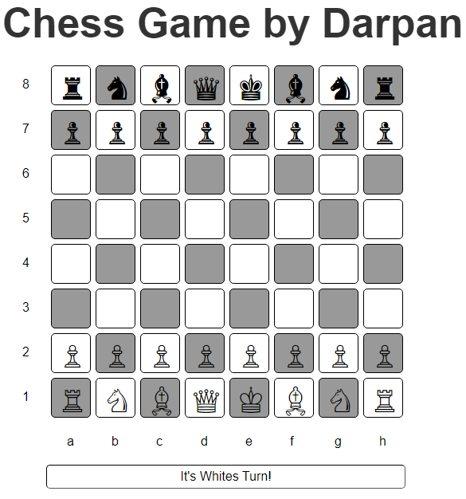

# JavaScript Chess Game

A simple and interactive chess game created using HTML, CSS, and JavaScript. This project provides a visual representation of a chessboard and allows players to take turns in a game of chess.

## Table of Contents

- [Demo](#demo)
- [Features](#features)
- [Installation](#installation)
- [Usage](#usage)
- [Technologies Used](#technologies-used)
- [Contributing](#contributing)
- [License](#license)

## Demo



## Features

- Interactive chessboard with 64 cells.
- Visual turn indicator showing whose turn it is.
- Hover effects for cells to enhance interactivity.
- Simple and responsive design.

## Installation

To get a local copy of the project up and running, follow these steps:

1. Clone the repository:

   ```bash
   git clone https://github.com/Federal2JZ/chess-game.git
   ```
2. Navigate to the project directory
   ```bash
   cd chess-game
   ```
3. Open the `index.html` file in your preferred browser.

## Usage
1. Load the `index.html` file in your web browser.
2. Click on the cells to make moves. The game alternates turns between players.
3. The current player's turn is indicated at the bottom of the game.

## Technologies Used
- HTML: For the structure of the chessboard and game layout.
- CSS: For styling the chessboard and game elements.
- JavaScript: For game logic and interactivity.
- jQuery: Included for easier DOM manipulation and event handling.

## License
This project is licensed under the MIT License. See the LICENSE file for details.